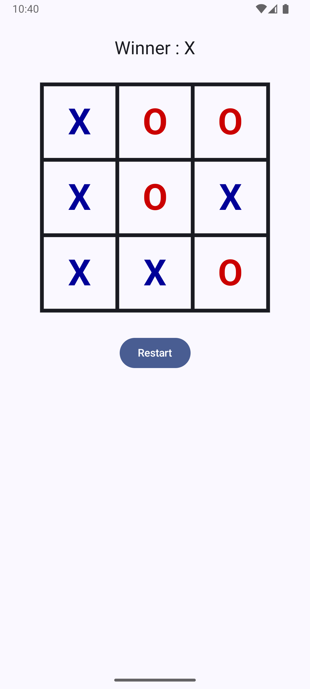
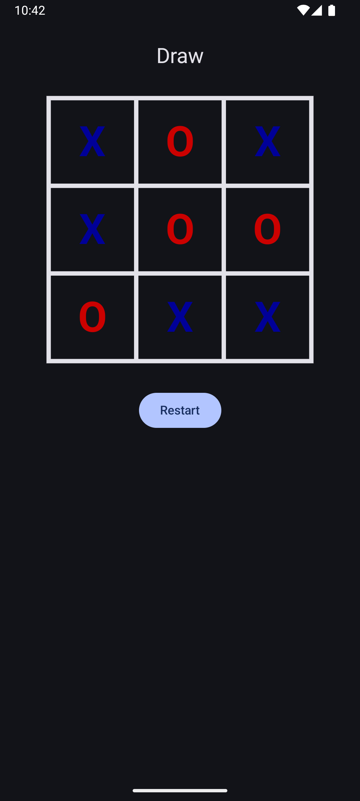

# Tic Tac Toe – Android (Jetpack Compose + TDD)

This project is a simple **Tic Tac Toe game** built from scratch using **Jetpack Compose** and developed following **Test Driven Development (TDD)** principles.  

---

## How to Build and Run

### Prerequisites
- Android Studio Hedgehog (or newer)
- JDK 17
- Android SDK 34+

### Steps
1. Clone the repository
2. Open the project in Android Studio
3. Let Gradle sync
4. Run the app on an emulator or physical device

No additional configuration is required.

---

## Technologies & Libraries

### Core
- **Kotlin**
- **Jetpack Compose** (UI)
- **Material 3**
- **StateFlow**

### Architecture
- **MVVM**
- **Clean Architecture**
- **Use Cases (Business Logic Layer)**

### Dependency Injection
- **Koin**

### Testing
- **JUnit**
- **TDD approach (domain → ViewModel → UI)**

---

## Game Logic

- X always starts
- Players alternate turns
- A move cannot be played on an occupied cell
- The game ends when:
    - A player has 3 symbols aligned (row, column, diagonal)
    - Or the board is full (draw)

All rules are implemented in the **domain layer**, fully covered by unit tests.

---

## Architecture Overview

The project follows **Clean Architecture**:

- ui/ → Compose UI + ViewModel
- domain/ → Game rules, models, use cases
- di/ → Koin modules

---

## Dark Mode Support (Bonus)

The UI fully supports **Light and Dark mode**:
- Light mode: white background, black grid lines
- Dark mode: black background, white grid lines
- X is always blue
- O is always red

---

## Screenshots

#### Light Mode

#### Dark Mode
